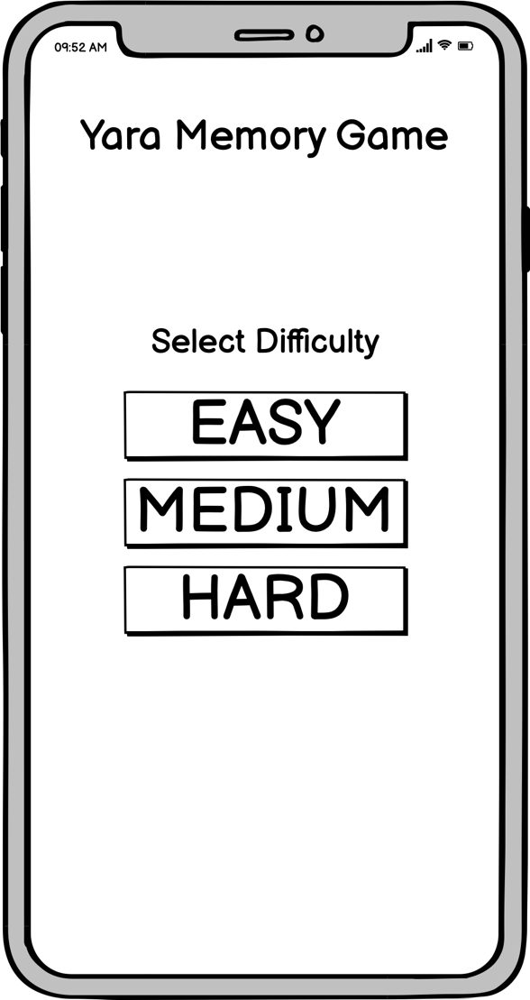
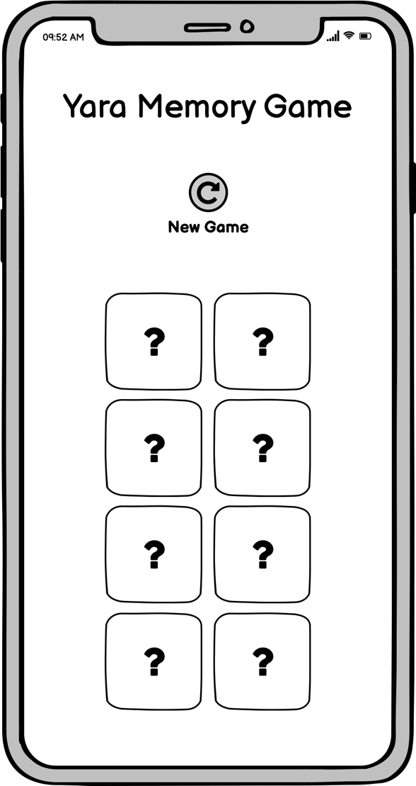
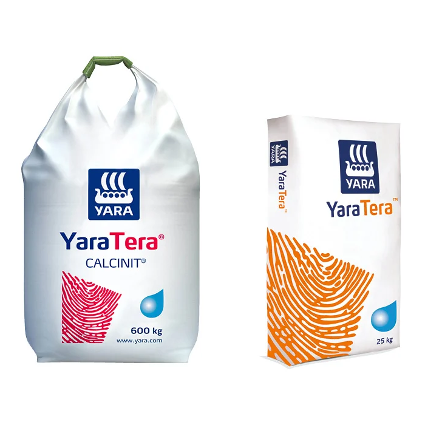
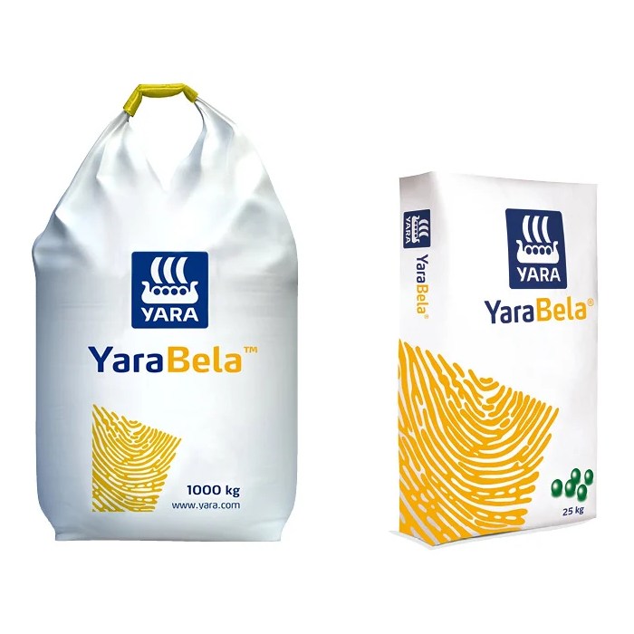
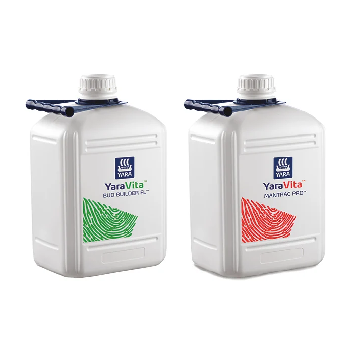
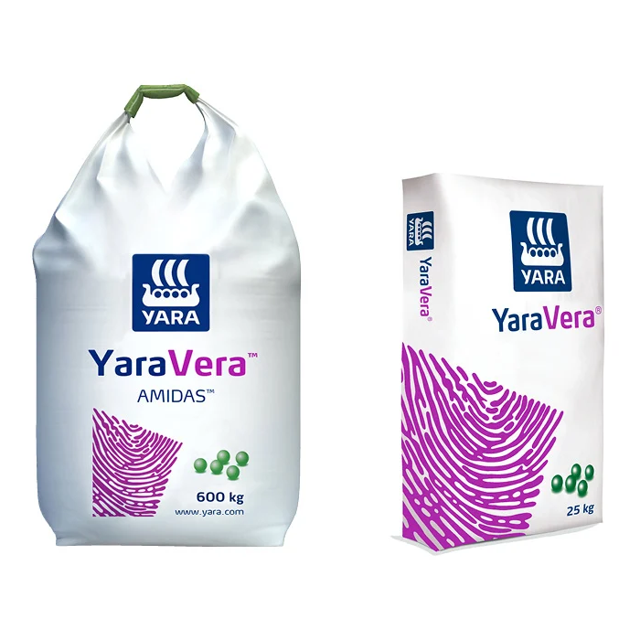
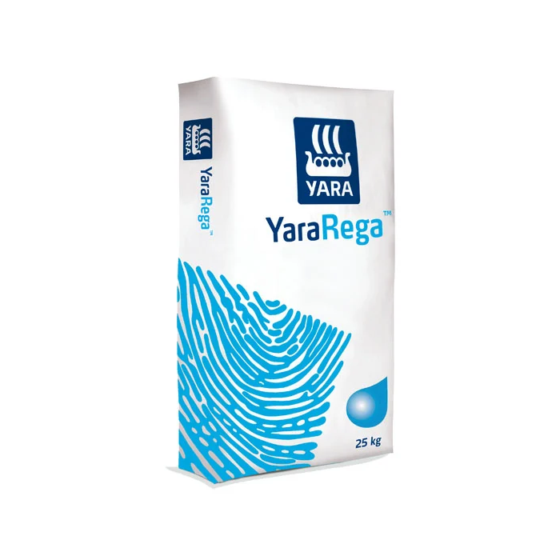
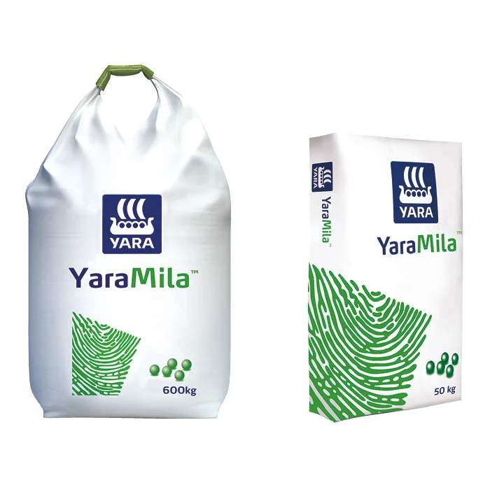
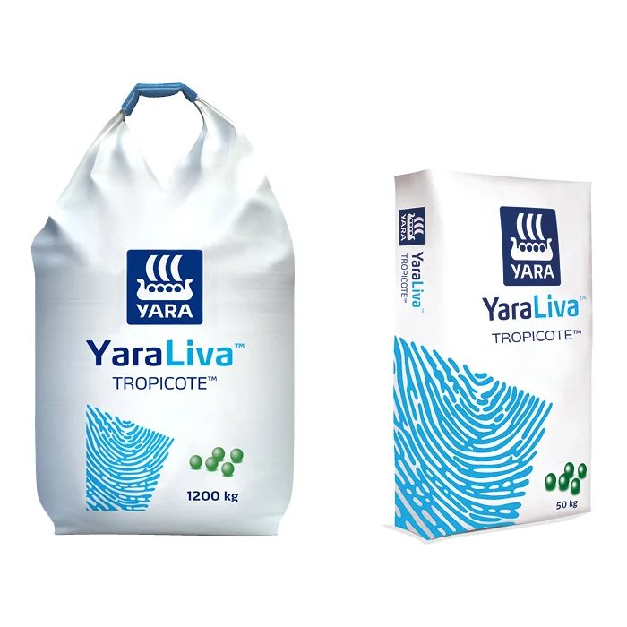

# Yara Coding Excerice - Memory Game

## General Notice

Please time-box this task to approximately max. two hours, we do not expect you to complete all the tasks in any way. It would be nice if the core features/concept are completed, but any further mentioned options are really purely optional and can be added/extended as you like. What we particularly value is that the submitted code is well structured, and has a mostly clean codebase.

_Note: If you can, please avoid adding/using other libraries._

We hope it will be fun and wish you good luck! 🙂

## Task Description

Build a small memory card game (if the game name doesn’t ring a bell, here is an article explaining the concept: [Memory (card game)](<https://en.wikipedia.org/wiki/Concentration*(card_game)>))
where you have to tap on a card to see what image is underneath it and try to find the matching image among the other cards. Once all card pairs have been found, the game is over and the user won.

_Note: We have included a folder (`./images/tileImages`) with 8 pictures of our Yara fertilizers among our company logo for you to use for the game tiles. You can view the images also in the [Card Tile Images](#card-tile-images) section._

## Core Concept

_Note: We have also included a design mockup folder (`./images/mockups`) of the application that you’re invited to use. It should complement the bullet point list underneath. You can view the images also in the [Memory Game Mockups](#memory-game-mockups) section._

- Once the application has started the user can see a grid with 2 x 4 cards/tiles (4 card pairs).

- Make sure that the card stack is always shuffled again when a new round starts.

- Add a button that allows the user to reset the game and starts a new game round.

- Add an action that flips a single card (by tapping on it) that changes the card state to visible. The card's image stays visible until the user has tapped on another card in the grid.

On 2nd card flip:

- If there is a match, the 2 currently flipped cards will be eliminated from the game (either hide/remove them or leave them in the visible state)

- If both cards don’t match, they will be flipped again (faced down) after 2 seconds and return to their initial state (hidden).

Also:

- It shouldn’t be possible to flip more than 2 cards to a visible state at the same time (unless they have been matched before).

- Once all card couples/pairs have been found, the player won and the round ends.

## Additional features

- Before starting the game the user should be allowed to choose between multiple levels of difficulties.

  - Easy (2x4 grid) | 8 cards (4 different images)

  - Medium (3x4 grid) | 12 cards (6 different images)

  - Hard (4x4 grid) | 16 cards (8 different images)

- Add a card flip animation.

## Memory Game Mockups

You can find those design mockups in the (`./images/mockups`) folder within this project.

|                                    Select Difficulty                                     |                                       Core Game                                        |
| :--------------------------------------------------------------------------------------: | :------------------------------------------------------------------------------------: |
|                           |                                        |
| ') | ') |

## Card Tile Images

You can find those tile images in the (`./images/tileImages`) folder within this project.

|                                                        |                                                     |                                                               |
| :----------------------------------------------------: | :-------------------------------------------------: | :-----------------------------------------------------------: |
|  |  |            |
|     |  |            |
|     |  |  |

## Finished?

Please work in a **private Github repo**, or at least push your final code there. When you are done, please give read access to [@valecarlos](https://github.com/valecarlos), [@rintel](https://github.com/rintel) and [@michi-trecker](https://github.com/michi-trecker)

We're very much looking forward to hearing from you!
